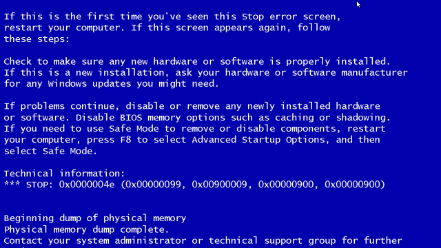

# Bem vindos! 😁
Eu sou Julio, sou desenvolvedor full-stack, estou na area um pouco mais de 2 anos desenvolvendo um api aqui, criando um bug ali 💻;
---

---
Entre em contato! 

https://www.linkedin.com/in/jc%C3%A9sar-da-silva//)

---

 
 

## English version

 

# Welcome! 😁
I'm Julio, I'm full stack developer, I've been in the area for a little over 2 years developing an api here, creating a bug there 💻;
---

---
Contact! 

https://www.linkedin.com/in/jc%C3%A9sar-da-silva//)

---

